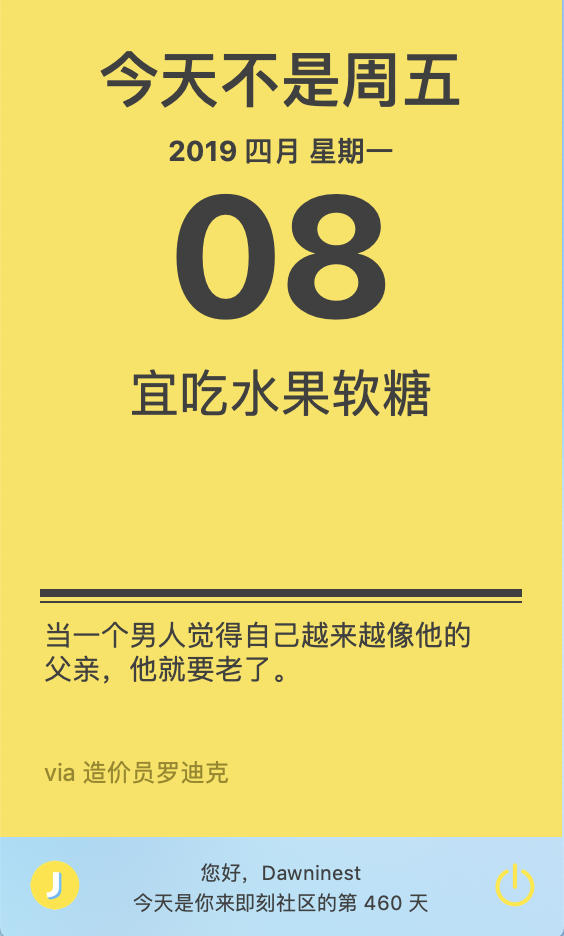

## jikeCalendar in macOS

 项目名: j2k (顾名思义 jike want to kxx me)

[

从6月25号开始,从即刻的黄历数据接口未拿到数据,正在咨询官方是否已经关闭此功能,

如果官方确认关闭,我将后续整合即可一些其他有意思的功能,甚至考虑做个 即刻mac版?(瓦恁打钱),

请谅解这种拿别人的数据二次开发的无奈和辛酸

]

### 即刻黄历macOS Saver

------

黄历锁屏壁纸(屏幕保护程序)

~~与dock 工具配套使用,需要在dock版中登录后,才能在屏保中拿到 "宜XX" 和 下面那句沙雕网友语录 的数据~~

现可不依赖 dock工具独立使用

效果图是这样(macOS 没法截图屏保)

------

## 即刻黄历macOS Dock 

------

请在issues 中给我提需求和bug, 我会认真的看的(不一定会改)

star越多,我敲代码的手就越快[死不要脸求star]

如果有某天即刻的数据有问题导致应用出现问题,请 issues 我

最新版的改动:

1. 使用Objective-C重构了saver项目,现在应该能支持更多低版本的系统了
2. 现在无需使用dock工具登录就可以拿到即刻的数据了,感谢 即友 @nondanee 的 [API接口](https://gitlab.com/nondanee/jike-daily-card-api) 

todo list:

1. 指定场景/定时弹出(hard)
2. ~~saver 的多显示器兼容问题~~
3. ~~saver 的 macOS 支持问题(修改工程的Deployment Target 到 10.11 ,依然反馈不支持,怀疑是低版本macOS对Swift 5 的支持问题,如果需要用OC或低版本Swift 重构的话,我可能不会处理这个问题)~~
4. issues 反馈的崩溃问题跟踪
5. ~~saver貌似比dock版要好用和实用得多,后续考虑将saver独立出来,不再强制需要打开dock版进行登录,将登陆功能集成进saver中(锁屏壁纸设置),~~

------

下载:    [[点击下载]](https://github.com/Dawninest/jikeCalendar-macOS/releases/download/v1.3.1/J2K.zip) (v1.3.1)

要求macOS版本 10.11及以上

屏保安装说明:  双击 j2k.saver 将自动添加至屏保列表中,合理配置屏保触发角可更加方便快捷使用

------

不妨也看看我做的[ [B站追番列表dock栏工具](https://github.com/Dawninest/b2k-macos) ],这个已经提供下载了并且有BUG可用

------

## [开发日程记录[日常碎碎念]](./devHis.md)

