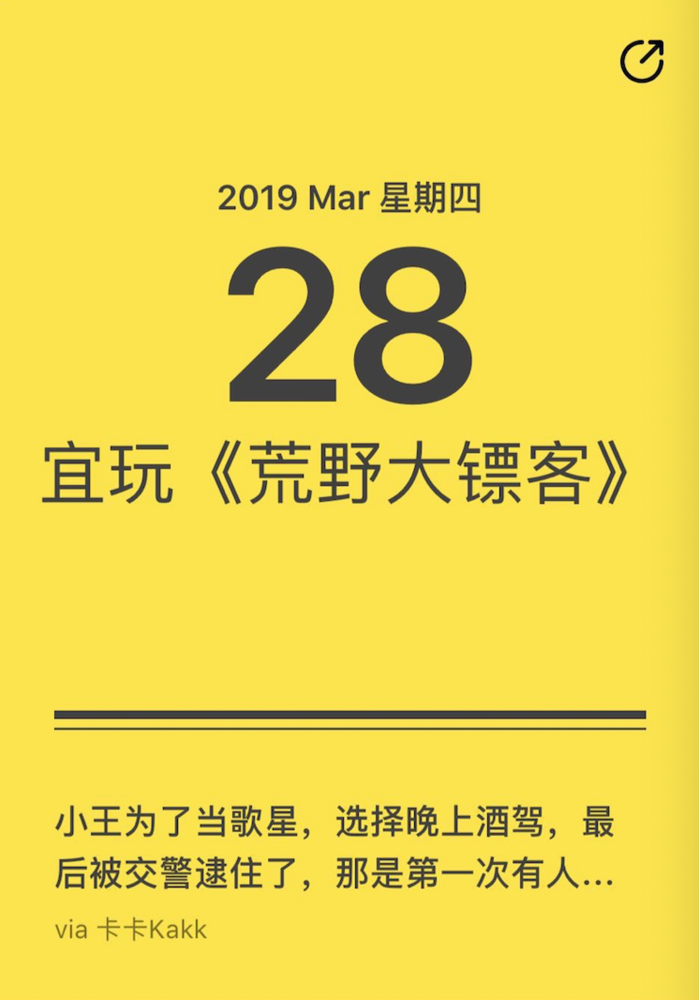
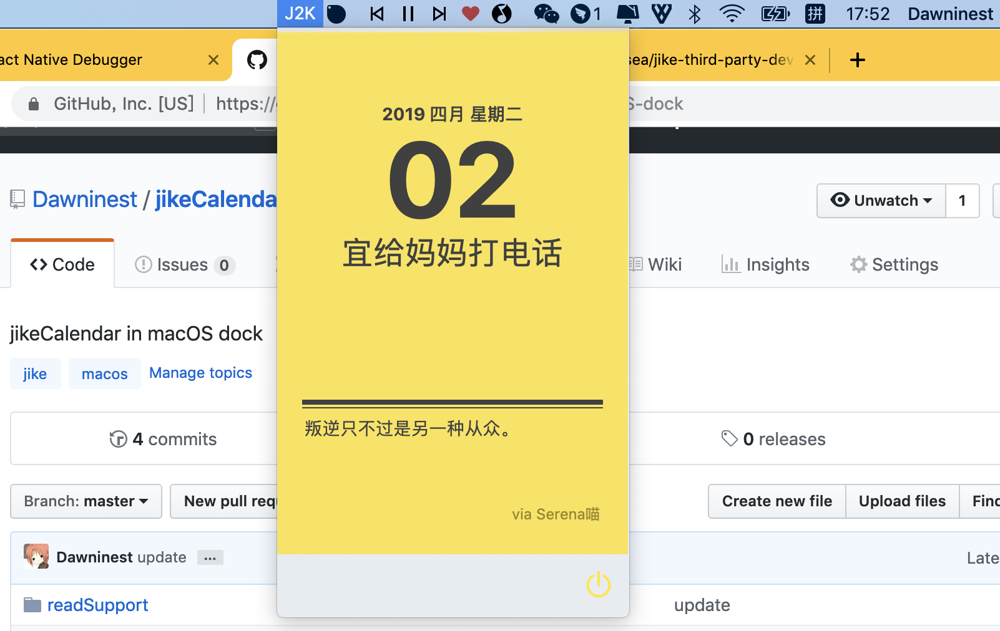

# jikeCalendar-macOS-dock
## jikeCalendar in macOS dock

## 即刻黄历macOS Dock版

------



如图所示,是 即刻 的探索页日历

作为 即刻的忠实用户,我琢磨着,要不整个这个放我mac dock栏上呗

于是便打算整一个

------

将在用户扫码登录功能完成后提供下载,敬请期待

star越多,我敲代码的手就越快[死不要脸求star]

todo list:

1. 增加用户扫码登录(如果能找到不用扫码也能拿到数据的方法就不要这条)
2. 注入灵魂,添加 "是否是星期五" 的功能
3. 底部功能栏目增加更多内容,没想好待定
4. logo设计
5. 指定场景/定时弹出

  x.  做一个类似 Filqlo 的即刻版锁屏壁纸

------


## 开发日程记录[日常碎碎念]

### 2019-4-3 logo

初版logo大约这个样子


想当年我大三出去找实习的时候,还是一名UI,但是不信那些🐶开发说我的设计做不出来,于是便转开发了.(其实是还是因为设计不符合开发规范)

写这个md的时候,忽然觉得这个logo怎么这么丑,嫌弃,回头有时间再整一版吧

### 2019-4-2 界面

基本功能完成,界面如图



### 2019-4-1 - 第三次尝试

今儿改完了公司项目的BUG之后,还是琢磨这个数据问题,真让人头大,于是琢磨着去看看即友们是怎么做的,参考了大佬的 [Jike-Metro](https://github.com/Sorosliu1029/Jike-Metro) 的.py源码和 [jike-meow-2](https://github.com/coder-ysj/jike-meow-2) 的Vue项目源码,(哇,我作为一个iOS开发,又能看懂py又能看懂js也是很厉害呀),发现了我之前的一个理解误区, 这个 

```
https://app.jike.ruguoapp.com/1.0/app_auth_tokens.refresh
```

这个刷新jwt的接口,其实只需要  x-jike-refresh-token 这个就能拿到我所需的用于数据请求的 jwt 了,

然后在web版扫描二维码登录之后会返回一个

```
{
  token: xxx,
  x-jike-access-token: xxx,
  x-jike-refresh-token: xxx,
}
```

然后用这里的 x-jike-refresh-token 去调 刷新jwt接口,

貌似 这个 x-jike-refresh-token 是不会过期的[通过其他渠道拿到的refresh-token会过期],

这样就能拿到的用于请求数据的 jwt 了

------

再简单分析一下这个登录的时候拿到的不会过期的特别refresh-token

在web端扫码登录得到

```
 token: 包含用户ID等信息,过期时间为15天后
 x-jike-access-token: xxx, 刚拿到时可用于请求数据,但是还是20-30分钟后过期了
 x-jike-refresh-token: xxx, 预计应该是一个有效期15天的的刷新jwt,解析该jwt仅仅能拿到申请时间,是否会过期还需要后续观察
```


综上所诉,现在我要能正确拿到数据有两种做法:

1.让用户每隔15天扫码登录一次,

2.我在代码里面使用我自己的账户信息,每隔15天更新一次

做法一的话,我比较省心,而且至少能保证一直能用,但是有违我想要做一款简单易用的dock工具的初衷,

做法二的话,我需要定期把自己的即刻账号的jwt更新到网络上,然后假设某一天忘了更新,会导致工具短暂地用不了.

### 2019-3-28 - 第二次尝试

改完了今天的BUG之后,忽然想到,即刻不是有网页版么,网页版的获取JWT和更新JWT要更好观察一些,不如搞一下

即刻网页版 - 登录

⌘⌥I - 开启页面检查器

拿到 JWT 

多次请求拼接尝试后,试出了正确的

```
https://app.jike.ruguoapp.com/1.0/dailyCards/list?x-jike-access-token=xxx
```

岂可修,但是这个 JWT 还是会更新的,周期大约 20 - 30 mins 左右,

查看网页的js文件,功力不够,没法从被混淆的代码里发现什么线索,


在这儿停顿! 	- 卢西奥(overwatch)


能在网页版上找到线索也算是有了思路,

后续打算在自己服务器上去拿 即刻网页版 的 jwt ,来维持jwt的有效

### 2019.3.27 - 第一次尝试

首先是数据接口

毕竟还是没有脸皮厚到去发邮件问,所以自己尝试抓包找线索咯

尝试用App抓包该数据的接口

```
url: https://app.jike.ruguoapp.com/1.0/dailyCards/list?coordsys=wgs84&date=2019-03-27
method: GET
headers: {
    x-jike-device-id: 'xxx',
    x-jike-access-token: 'xxx',
}
```

发现其 x-jike-access-token 是用于请求的关键JWT,但是十分钟更新一次

遂找到其更新 JWT 接口

```
url: https://app.jike.ruguoapp.com/1.0/app_auth_tokens.refresh
method: POST
headers: {	
	// 10 mins 刷新一次
	x-jike-access-token(新): ‘xxx’
	x-jike-refresh-token(用于刷新请求的token): ‘xxx’
}
```

解析 x-jike-refresh-token 这个JWT,得到

```
{
  "data": "2jVubuRnQRBvB375nOoxpBmV/CiYQ0qmOxkzXhraq0WbrC59W1Rma1V09102K3/RVtMB58421l227Nz4FpSa3BtHHYnhah79+d+sR4rdfQecMigIoSHz7NFksd7IPdBS1XhnO9UYGkhJd/xBbl1aPDIJPm0ysvjf53rrf9JM4z0rtD1HEU0lndLFuCFwQIamAxPxiSUQVbIo25xktGNw9Fcsex82TsxiXyu0d1CIHOIzgqApSI2ArM3oAVmXSPWlFhoFF3Ksg46PnJpJmR7Nqv93uXJwODo7+57Womr42/smDp5l6HZ0DLc5diWz5ttWIrUBcxSP9ZTgBPZk55Q3C5Lml4OpSxtTlJv2dAtvF8Tr8gBTKh+cr3axy+9qns3MMKyu4bx9I2Yj/CEm3Ll4uw==",
  "v": 3,
  "iv": "S9QY4Sh7Q6zKBRJ/0XCGWw==",
  "iat": 1553673189.169
}
```

可以看出 iat 是时间戳,其他代码疑似 RSA 加密


つづく
